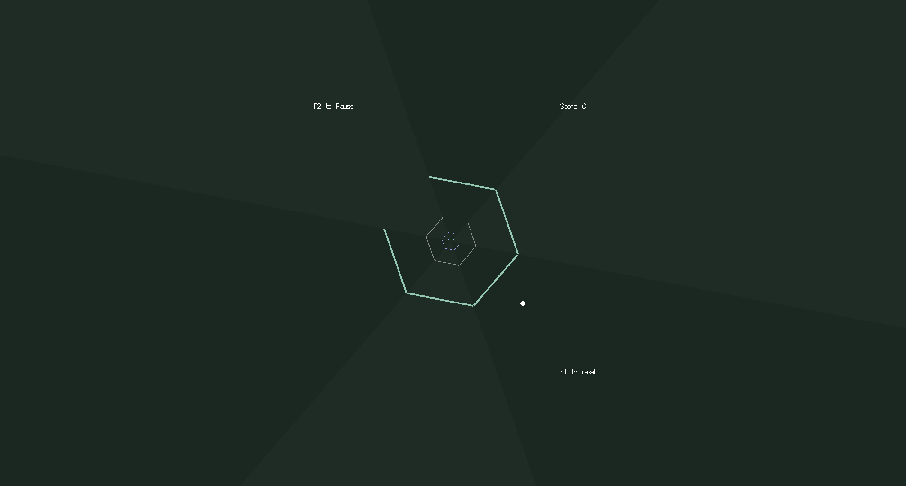

# Hexagon Game 


## Structure
1.  Code Structure
    * 3.1. Global Constants
    * 3.2. Data Structures
    * 3.3. Global Variables
    * 3.4. Function Definitions
2.  Gameplay
    * 4.1. Starting the Game
    * 4.2. Controlling the Player
    * 4.3. Scoring
    * 4.4. Pausing and Resuming
    * 4.5. Game Over
3.  Technical Details
    * 5.1. Initialization
    * 5.2. Rendering
    * 5.3. Animation and Updates
    * 5.4. Input Handling
    * 5.5. Collision Detection
4.  Compilation and Running
5.  Future Enhancements

## Game Description

The game screen features a rotating background and a series
of expanding hexagons. Each hexagon has one missing side.
The player, represented by a circle, is positioned at a
fixed distance from the center.

The player can rotate clockwise or counter-clockwise using
the arrow keys. The objective is to align the player's
position with the missing segment of each passing hexagon.

If the player collides with a solid part of a hexagon, the
game ends. Successfully passing through a missing segment
increases the player's score.

### 3.1. Global Constants

These constants define various parameters of the game:

* `WINDOW_WIDTH`: The width of the game window in pixels (800).
* `WINDOW_HEIGHT`: The height of the game window in pixels (600).
* `TIMER_PERIOD`: The interval (in milliseconds) for the
    timer function, controlling the animation speed (25 ms).
* `SCALE_SPEED`: The factor by which the hexagons' scale
    increases in each frame (1.020).
* `HEXAGON_DELAY`: The time (in milliseconds) between the
    appearance of new hexagons (1250 ms).
* `COLOR_CHANGE`: A boolean flag to enable or disable
    periodic color changes of hexagons and background (true).

### 3.2. Data Structures

Several `struct` types are defined to organize game data:

* `color_t`: Represents a color with red (`r`), green (`g`),
    and blue (`b`) components (floats).
* `hexagon_t`: Stores information for each hexagon:
    * `color`: The color of the hexagon (`color_t`).
    * `scale`: The current scale of the hexagon (float).
    * `missingPart`: An integer (0-5) indicating the index
        of the missing side.
* `game_control_t`: Manages the game state:
    * `isStarted`: A boolean indicating if the game has started.
    * `pause`: A boolean indicating if the game is paused.
    * `animate`: A boolean indicating if the initial
        animation is playing.
* `score_t`: Keeps track of the player's score:
    * `current`: The current score (integer).
    * `max`: The maximum score achieved (integer, initialized to -1).

### 3.3. Global Variables

These variables hold the current state and other important
data for the game:

* `score`: An instance of the `score_t` structure.
* `width`, `height`: The current width and height of the
    game window (integers).
* `game`: An instance of the `game_control_t` structure.
* `hexagons[4]`: An array of 4 `hexagon_t` structures,
    representing the currently active hexagons.
* `input`: An integer (0-5) representing the player's
    current rotational position (corresponding to one of the
    six hexagon sides).
* `timerCount`: An integer counting the number of times the
    timer function has been called.
* `background`: An instance of the `color_t` structure
    defining the background color.
* `maxScale`: A float representing the maximum scale a
    hexagon reaches before being reset.
* `initialScale`: A float representing the initial scale of
    newly generated hexagons.
* `rotation`: A float representing the current rotation angle
    of all game elements.
* `rotateSpeed`: A float representing the speed of rotation,
    which changes randomly.
* `scale`: A float representing the overall scale of the
    scene, used for the initial animation.

### 3.4. Function Definitions

The code includes several functions responsible for different
aspects of the game:

* `initializeGlobals()`: Initializes all global variables
    to their default starting values.
* `circle(int x, int y, int r)`: Draws a circle centered at
    `(x, y)` with radius `r` using `GL_POLYGON`.
* `drawString(const char* string)`: Draws a string on the
    screen using GLUT stroke font.
* `displayBackground()`: Draws the rotating triangular
    background.
* `displayHexagons()`: Draws the four currently active
    hexagons, with their missing parts.
* `displayPlayer()`: Draws the player's circle at its
    current rotational position.
* `displayUI()`: Draws the user interface elements,
    including start screen, score, pause message, and reset
    instruction.
* `display()`: The main display function called by GLUT to
    render the scene. It clears the buffer, applies
    transformations, and calls other drawing functions.
* `ASCIIKeyDown(unsigned char key, int x, int y)`: Handles
    keyboard input for ASCII characters (e.g., ESC to exit).
* `SpecialKeyDown(int key, int x, int y)`: Handles keyboard
    input for special keys (e.g., arrow keys for movement,
    F1 to start/reset, F2 to pause/continue).
* `reshape(int w, int h)`: Called when the window is resized,
    it updates the viewport and projection matrix.
* `onTimer(int v)`: The timer function called periodically.
    It updates the game state (animation, rotation, hexagon
    scaling, collision detection, scoring, color changes) and
    triggers a redisplay.
* `main(int argc, char *argv[])`: The main function that
    initializes GLUT, creates the window, registers callback
    functions, and starts the GLUT main loop.

## 4. Gameplay

### 4.1. Starting the Game

The game starts with an initial animation where the scene
scales down and rotates. The start screen displays "F1 to
Start" and instructions for movement. Pressing the `F1` key
initializes the game state and begins the gameplay. If a
previous game was played, the start screen also shows the
"Max Score" and "Last Score".

### 4.2. Controlling the Player

During the game, the player can rotate using the left and
right arrow keys:

* `Left Arrow`: Rotates the player counter-clockwise.
* `Right Arrow`: Rotates the player clockwise.

The `input` variable tracks the player's current orientation,
corresponding to one of the six segments around the center.

### 4.3. Scoring

The player earns one point for each hexagon successfully
passed through its missing segment without collision. The
current score is displayed on the top right of the screen.
The maximum score achieved is stored and displayed on the
start/game over screen.

### 4.4. Pausing and Resuming

The game can be paused and resumed by pressing the `F2` key.
When paused, the animation and game logic are stopped, and a
"F2 to Continue" message is displayed. Pressing `F2` again
resumes the game.

### 4.5. Game Over

The game ends if the player collides with a solid part of a
hexagon. When the game ends:

* The `isStarted` flag is set to `false`.
* If the current score is higher than the maximum score,
    the maximum score is updated.
* The game returns to the start screen, displaying the "F1
    to Start" message, movement instructions, and the "Max
    Score" and "Last Score".
* Pressing `F1` resets the game, re-initializes all
    variables, and starts a new game with the initial
    animation.

## 5. Technical Details

### 5.1. Initialization

The `initializeGlobals()` function sets up the initial state
of the game:

* Resets the `input`, `scale`, and `score.current`.
* Sets the `game.isStarted` and `game.pause` flags to `false`.
* Sets `game.animate` to `false` initially, and to `true`
    when the game is started with `F1`.
* Randomly determines the initial `rotateSpeed`.
* Initializes the `rotation` to 0.
* Calculates `initialScale` and `maxScale` based on the
    `SCALE_SPEED` and `HEXAGON_DELAY` to ensure smooth
    hexagon appearance and scaling.
* Initializes each hexagon in the `hexagons` array with a
    random color, a calculated initial scale, and a random
    `missingPart`.
* Sets a random initial `background` color.

### 5.2. Rendering

The `display()` function handles the rendering of all game
elements:

* Clears the color buffer with the current `background` color.
* Loads the identity matrix to reset transformations.
* Applies the global `scale` for the initial animation.
* Applies the global `rotation` if the initial animation
    (`game.animate`) is active.
* Calls `displayBackground()`, `displayHexagons()`,
    `displayPlayer()`, and `displayUI()` to draw the
    respective elements.
* Swaps the front and back buffers to display the rendered
    scene.

The individual `display...()` functions use OpenGL primitives
(`glBegin`, `glEnd`, `glVertex2f`, `glColor3f`, `glPushMatrix`,
`glPopMatrix`, `glTranslatef`, `glRotatef`, `glScalef`,
`glRectf`) to draw the shapes and apply transformations.

### 5.3. Animation and Updates

The `onTimer()` function is the core of the game's animation
and logic updates:

* It is called repeatedly based on the `TIMER_PERIOD`.
* During the initial animation (`game.animate`), it updates
    the `scale` (decreasing) and `rotation` (increasing) to
    create the zoom-in and spin effect. Once `scale` reaches
    1, the animation ends, and the game `isStarted`.
* If the game is started and not paused:
    * It increments `timerCount` and updates the `rotation`
        based on `rotateSpeed`.
    * It iterates through the `hexagons` array:
        * Checks for collision by comparing the scale to a
            threshold (approximately when the hexagon reaches
            the player) and the player's `input` with the
            hexagon's `missingPart`. If a collision occurs,
            the game ends, and the score is updated.
        * If no collision, and the player is aligned with
            the missing part, the `score.current` is
            incremented.
        * The `scale` of each hexagon is increased by
            `SCALE_SPEED`.
        * If a hexagon's `scale` exceeds `maxScale`, it is
            reset to `initialScale`.
    * Periodically (based on `timerCount` and `COLOR_CHANGE`):
        * The colors of all hexagons and the background are
            randomly changed.
        * The `rotateSpeed` is randomly changed.
    * Less frequently, a larger random rotation is applied to
        add variation to the gameplay.
* Finally, it calls `glutPostRedisplay()` to trigger a redraw
    of the scene.

### 5.4. Input Handling

The `ASCIIKeyDown()` and `SpecialKeyDown()` functions handle
keyboard input:

* `ASCIIKeyDown()` currently only handles the `ESC` key to
    exit the game.
* `SpecialKeyDown()` handles:
    * Left and right arrow keys to change the player's
        `input` (rotation).
    * `F1` key to start a new game or reset the current one.
    * `F2` key to pause or resume the game by toggling the
        `game.pause` flag.

### 5.5. Collision Detection

Collision detection is implemented within the `onTimer()`
function. It checks if a hexagon has reached a certain scale
(close to the player's radius) and if the player's current
`input` (rotational position) matches the `missingPart` of
that hexagon. If the scales are close and the `input` does
not match the `missingPart`, a collision is detected, and
the game ends.

## 6. Compilation and Running

To compile and run this game, you need a C/C++ compiler (like
GCC) and the GLUT library installed on your system.

1.  **Save:** Save the code as a `.c` file (e.g., `hexagon_game.c`).
2.  **Compile:** Open a terminal or command prompt and use the
    following command to compile (you might need to adjust the
    GLUT library linking flags based on your system):

    ```bash
    gcc hexagon_game.c -o hexagon_game -lglut -lGL -lGLU -lm
    ```

3.  **Run:** Execute the compiled program:

    ```bash
    ./hexagon_game
    ```

